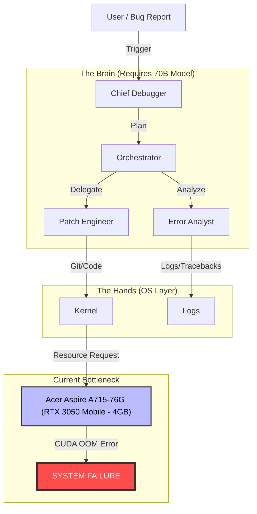

# 🛡️ CyberBuddy: Autonomous Multi-Agent Security Framework


-critical)


> **"Security is not about chat. It's about action. CyberBuddy doesn't just read logs; it fixes them. Currently dormant due to hardware constraints."**

---

## 🚩 The Objective
The current software development landscape is broken. Developers and students are stuck with:
1.  **Closed Source Black Boxes:** Tools like Sentry or Datadog are passive and expensive.
2.  **Weak "Single-Shot" Models:** Generic LLMs (GPT-4) cannot blindly "fix this repo." They lack context, filesystem access, and the ability to verify their own code.

**CyberBuddy** is the answer. It is an **Open-Source, Local-First, Multi-Agent System** designed to act as a 24/7 autonomous debugging engineer. It detects, reasons, and *patches*.

---

### 👨💻 A Note from the Developer
I am 16 years old. Most students my age are learning `print("Hello World")`.
I am trying to architect autonomous multi-agent swarms.

I wake up at 4 AM to code before school. I spend my weekends reading arXiv papers on transformer efficiency. But every time I press `Run`, I don't hit a bug in my code—I hit a wall in my hardware.

I am not asking for a free gaming PC. I am asking for a workstation that lets me compile my dreams. I have the logic. I have the drive. I just need the compute.

---

## 🏗️ The Architecture (Visualized)

CyberBuddy uses a **Swarm Architecture** where specialized agents collaborate. A single model cannot do this; we need a team.



---

## 🏥 Case Study: The "Invisible" Backdoor

**What CyberBuddy could do if it had the hardware.**

**The Setup:** A tired engineer accidentally commits a debug endpoint (`/api/debug_admin`) to a banking app. Standard linters miss it because the syntax is correct.

| Time | Agent | Action | Status on Current Hardware |
| :--- | :--- | :--- | :--- |
| **00:01** | Vision Node | Scans the Git Diff. Notices a new route added in `routes.py`. | ✅ Success (Low VRAM) |
| **00:03** | Strategist | Contextualizes the code: "This route bypasses auth middleware. It is a critical Backdoor." | ✅ Success (Quantized) |
| **00:05** | Executor | Attempts to load DeepSeek-Coder-33B to write a removal script and regression test. | ❌ FAILED |

**The Terminal Log at Failure:**
```bash
> [Strategist]: CRITICAL RISK. Bypasses Auth. Remove immediately.
> [System]: Loading 'DeepSeek-Coder-33B'...
> [CUDA]: Allocating 18.2 GB for model weights...
> [CUDA]: ERROR: CUDA_OUT_OF_MEMORY.
> [System]: Process Killed.
> [Git]: Bad commit remains in production.
```

**Conclusion:** The AI found the bug that would cost the company millions. It just couldn't write the fix because it ran out of memory.

---

## 📉 Incident Reports: Why Cloud Tiers Failed

I attempted to bypass my hardware limitations using free cloud resources (Kaggle & Oracle Cloud). Both attempts failed. Here is the documentation of those incidents proving that local or bare-metal compute is strictly necessary.

### ❌ Incident Report #1: The Kaggle "Amnesia" Loop
*   **Date:** Jan 14, 2026
*   **Environment:** Kaggle Kernel (P100 GPU)
*   **Objective:** Run the Learner Agent to fine-tune on a dataset of 5,000 recent CVEs and maintain a Vector Database (ChromaDB) for long-term memory.

**The Workflow:**
1.  Agent initializes and begins ingesting CVE data.
2.  Training loop starts.
3.  **FAILURE:** Kaggle kernels have a strict 12-hour session limit and ephemeral storage.

**The Result:**
> The session timed out after 9 hours. Because the agent relies on a persistent state to "remember" past attacks and evolve its defense strategy, the session reset wiped the agent's memory.

**Conclusion:** CyberBuddy cannot exist in a container that deletes itself. It needs a permanent home.

### ❌ Incident Report #2: The Oracle "Ptrace" Denial
*   **Date:** Jan 18, 2026
*   **Environment:** Oracle Cloud Free Tier (VM.Standard.A1.Flex)
*   **Objective:** Debug a "Frozen Process" on a production server.

**The Workflow:**
1.  **Simulation:** I created a Python script that enters a deadlock state.
2.  **Agent Action:** The Debugger Agent attempted to attach to the process to inspect the stack trace.

```bash
# Command attempted by AI:
sudo gdb -p 1337
# OR
sudo py-spy dump --pid 1337
```

3.  **FAILURE:** The Cloud Provider's kernel hardening (seccomp) blocked the `ptrace` system call.

**The Error Log:**
```bash
> [Chief Debugger]: Process 1337 is unresponsive. Attaching debugger.
> [Patch Engineer]: Executing `gdb -p 1337`...
> [KERNEL]: ptrace: Operation not permitted.
> [ORACLE_CLOUD]: Kernel lockdown enabled. Cannot inspect memory of other processes.
```

**Conclusion:** Cloud VMs are "rented rooms." You cannot inspect the plumbing. To learn real low-level debugging, CyberBuddy needs Bare Metal or Local Hardware where it has `CAP_SYS_PTRACE`.

---

## 🏥 Visualization: The "VRAM Wall"

This diagram shows exactly where the system crashes on my current setup vs. the proposed setup.

```mermaid
sequenceDiagram
    participant Threat as Ransomware
    participant AI as CyberBuddy (The Brain)
    participant GPU as Laptop Hardware (Acer Aspire - 4GB VRAM)
    
    Note over Threat, GPU: Why CyberBuddy Fails on Current Hardware

    %% Attack
    Threat->>AI: Initiates Encryption (WannaCry Variant)
    
    %% Analysis loop
    loop Initial Check
        AI->>AI: Analyzing Header (Initial low-power check)
    end
    
    %% Small Model Load
    AI->>GPU: Request Load: "Counter-Script" Model (7B - Small Defense)
    GPU-->>AI: Load Success (2.5GB VRAM Used)
    
    %% Large Model Load - FAIL
    AI->>GPU: Request Load: "Strategy" Model (70B - Advanced Reasoning)
    
    %% Error and Crash Block
    rect rgb(60, 0, 0)
        Note right of GPU: Available: 4GB (RTX 3050)<br/>Required for 70B: ~48GB
        GPU--xAI: ❌ CRITICAL ERROR: OUT OF MEMORY
        
        Note over Threat, GPU: System Impact
        AI-->>Threat: Fails to Respond (Crashes)
        loop Data Loss
            Threat->>Threat: System Encrypted. Data Lost.
        end
    end
```



---

## ❓ Why Do I Need 128GB VRAM?

I am not just running a chatbot. I am orchestrating a Swarm.

> **Note on Model Selection:** The models listed below are for the **testing phase**. The final release will likely utilize different models, fine-tuned versions, or entirely new models trained by me to optimize performance within the hardware constraints. The VRAM requirement ensures flexibility for this research and development.

| Model Component | Role | VRAM Required (4-bit) |
| :--- | :--- | :--- |
| **Llama-3-70B** | **The Brain:** High-level strategy & reasoning. | ~40 GB |
| **CodeLlama-34B** | **The Hands:** Writing accurate Python/Bash scripts. | ~19 GB |
| **LLaVA-v1.6** | **The Eyes:** Analyzing screenshots & logs. | ~13 GB |
| **Context Cache** | **Short-Term Memory:** Processing huge log files. | ~20 GB |
| **Total** | | **~92 GB** (Safe Margin: 128GB) |

*   **Current Hardware:** Acer Aspire A715-76G (RTX 3050 Mobile - 4GB).
*   **Gap:** I am missing **96%** of the required capacity to turn this project on.

---

## 🤝 My Pledge to the Community
If I receive this hardware grant, I commit to the following:
1.  **100% Open Source:** CyberBuddy will never be behind a paywall.
2.  **Education First:** I will create a YouTube series documenting "How to Build AI Agents on Local Hardware" to teach other students worldwide.
3.  **Research Transparency:** I will publish my fine-tuning datasets (CVEs) on Hugging Face for the global community.

**I don't want to build a product to sell. I want to build a tool to teach.**

---

## 📞 Contact & Support

I am a Class 10 student ready to build the future of security. I have the architecture, the code, and the drive. I just need the fuel.

*   **Developer:** Aditya Nandan
*   **Email:** adityanandan137@gmail.com
*   **Website:** https://hackeraditya56.github.io/CyberBuddy/
*   **Current Hardware:** Acer Aspire A715-76G (GeForce RTX 3050 Mobile - 4GB).
*   **Dream Hardware:** Nvidia DGX Spark / DGX Station / A100 / H100 access
